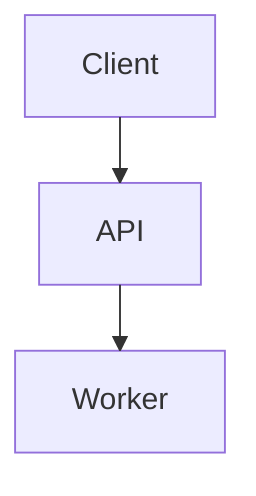

# Mermaid Markdown Rendering Design

## Goal

Render Mermaid diagrams in the browser wherever Pi Livecraft renders Markdown, matching the explicit-fence behavior users expect from GitHub and GitLab. This includes assistant and user conversation messages and Markdown file/tool previews.

## Scope and behavior

- Recognize only explicit fenced code blocks marked `language-mermaid` (written as ` ```mermaid ` in Markdown).
- Render Mermaid blocks as static, responsive SVGs in place within surrounding Markdown.
- Preserve all surrounding Markdown content, including headings, paragraphs, lists, and additional code blocks.
- Support Mermaid's optional open-source ELK layout integration for diagrams that request `layout: elk`.
- Keep ordinary code blocks unchanged.
- Do not add pan, zoom, node-click actions, or other diagram interactivity in v1.
- A nested Mermaid fence inside another code fence remains source text and is not rendered.
- A Markdown file remains portable source on disk; Livecraft renders Mermaid when the file is shown through its Markdown preview.

## Architecture

All behavior belongs at the existing shared Markdown boundary in `src/features/conversation/Markdown.tsx`:

```text
ReactMarkdown
  └─ code renderer
       ├─ language-mermaid
       │    └─ MermaidDiagram
       │         ├─ lazy Mermaid + optional ELK
       │         ├─ static SVG
       │         └─ source/error fallback
       └─ all other code
            └─ existing MarkdownCode
```

The custom Markdown `code` renderer routes exactly `language-mermaid` blocks to a new `MermaidDiagram` component. All other blocks continue through the existing code rendering and lazy syntax-highlighting path. Because conversation messages and Markdown tool/file previews already share `Markdown`, no separate surface-specific implementation is needed.

`MermaidDiagram` should lazy-load Mermaid and the ELK integration so ordinary Markdown does not pay the diagram-rendering cost in the initial bundle. Package versions and the exact registration API must be verified against current package metadata before implementation.

## Layout and theme

Mermaid's normal layout remains the default. A diagram may request the optional open-source ELK layout through Mermaid configuration/frontmatter, for example:

````markdown

````

ELK is an enhancement, not a requirement for every diagram. It should be loaded and used when requested. If the optional layout path fails, use the same source-preserving fallback as any other render failure rather than hiding the diagram.

The generated SVG should use the current application theme and be constrained responsively to the available width. Theme changes should trigger a re-render through the existing theme mechanism; no Mermaid-specific preference is needed.

## Security and error handling

Diagram content is untrusted Markdown content:

- Configure Mermaid with restrictive security settings, avoiding arbitrary HTML and unsafe link behavior by default.
- Insert Mermaid's generated SVG only; never insert the original diagram source as HTML.
- Generate a stable collision-resistant render ID for each diagram so multiple diagrams can coexist.
- Keep fallback content in a normal `<pre><code>` block for safe display and copyability.

When rendering fails because syntax is invalid, content is incomplete during streaming, or ELK cannot process the requested layout:

- Show the original Mermaid source as a normal code block.
- Add a compact, non-blocking error indicator such as “Mermaid could not be rendered.”
- Do not expose a large Mermaid stack trace in the conversation.
- Never hide or discard the source.

## Agent-facing guidance

Add a project skill document under `.pi/skills/` that teaches Pi to:

- Use explicit ` ```mermaid ` fences for diagrams.
- Embed those fences naturally inside explanatory Markdown when appropriate.
- Prefer valid, reasonably scoped Mermaid syntax.
- Use `config.layout: elk` for dense, hierarchical, or heavily connected diagrams where it improves readability.
- Avoid assuming that every Mermaid feature or diagram type supports ELK.
- Split very large diagrams when that produces a clearer result.

The skill is guidance only; the browser renderer remains authoritative and must handle invalid or unsupported content safely.

## Validation and acceptance criteria

Focused tests or equivalent browser-level checks must cover:

- Explicit Mermaid fence recognition.
- Ordinary code blocks remaining ordinary code blocks.
- Mermaid embedded among headings, prose, and other Markdown.
- Successful static SVG rendering.
- Invalid/incomplete syntax preserving the original source with an error indicator.
- The ELK configuration path.
- Multiple diagrams coexisting without ID collisions.

Run the focused tests available for the Markdown/conversation renderer, then:

```bash
npm run typecheck
npm run lint
npm run format:check
npm run build
```

## Explicit non-goals

- Server-side Mermaid rendering.
- External Mermaid services or CDN loading.
- Automatic detection of Mermaid syntax in unlabeled code blocks.
- Pan/zoom, node interactions, or editable diagram controls.
- Changing the Markdown source stored on disk.
